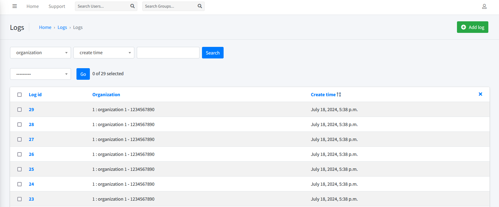

# Cloud-SIEM
A Fully Functional Cloud Security Information and Event Management (SIEM) Software Built with Microservice Architecture with Various Standalone Components Designed and Implemented for Flexibility and Robustness

## Architecture
By following the Microservice Architecture, we are able to plug and play multiple different services into the SIEM software that can add or change functionality of various parts without interfering with other services.


As can be seen in the architecture diagram, the SIEM software can be broken down into six main micro-services, each responsible for an integral part of the SIEM workflow. Here are the six microservices:

1. Web Server
2. Log Retention
3. Real-Time Logs Processor
4. Real-Time Notifications Processor
5. User Interface
6. Non Real-Time Processors

Each of these micro-services can be deployed independently with minimal coupling with other microservices. We will dive into more details for each micro-service in the subsequent sections.

## Data Flowchart

Here's a chart showing the flow of logs, starting from clients' AWS Cloud logs being sent to the Web Server microservice dedicated to receive and perform initial processing of the logs, while abstracting away the internal communication micro-services.


## RabbitMQ Queues and Exchanges

RabbitMQ is the core message passing technology used for communication in the Cloud SIEM Microservice Architecture. Specifically, when fully deployed there will be four exchanges and five queues dedicated for communication between various microservices.

### RabbitMQ Exchanges
Ignoring the default AMQ exchanges, the following four exchanges are used for communication among various microservices as described below:

1. `logs_fanout_exchange`: The `Web Server` microservice uses this `fanout` exchange as its producer to publish raw clients' AWS CloudTrail logs received. The `Log Retention` and `Real-Time Logs Processor` microservices both consume from this exchange.
2. `notifications_exchange`: The `Real-Time Logs Processor` microservice uses this `direct` exchange as its producer to publish notification actions. The `Notifications Processor` microservice consumes from this exchange.
3. `notifications_subscription_exchange`: The `User Interface` microservice uses this `direct` exchange as its producer to publish events about changes in the clients' notification subscriptions. The `Notifications Processor` microservice consumes from this exchange.
4. `rules_exchange`: The `User Interface` microservice uses this `direct` exchange as its producer to publish events about changes in the clients' rules. The `Real-Time Logs Processor` microservice consumes from this exchange.


### RabbitMQ Queues
The following five queues are used for communication among various microservices as described below:

1. `logs_fanout_receiving_queue_for_notifications`: The `Real-Time Logs Processor` microservice consumes from this queue that is subscribed to the `logs_fanout_exchange` to receive logs for further processing.
2. `logs_fanout_receiving_queue_for_retention`: The `Log Retention` microservice consumes from this queue that is subscribed to the `logs_fanout_exchange` to receive logs for storage.
3. `notifications_direct_receiving_queue_for_dispatch`: The `Notifications Processor` microservice consumes from this queue that is subscribed to the `notifications_exchange` to receive action items (notifications) for dispatching.
4. `notifications_subscription_direct_receiving_queue_for_update`: The `Notifications Processor` microservice consumes from this queue that is subscribed to the `notifications_subscription_exchange` to update its notification subscriptions.
5. `rules_direct_receiving_queue_for_update`: The `Real-Time Logs Processor` microservice consumes from this queue that is subscribed to the `rules_exchange` to receive rules for applying them when processing logs.


## Web Server Microservice
The Web Server micro-service is responsible for receiving the logs from clients' AWS Cloud and dispatch them for retention and further processing. Specifically, the Web Server receives AWS CloudTrail logs from authenticated and authorized clients' AWS Cloud and after minimally processing them for validity, dispatches them into a `RabbitMQ` `fanout exchange` where two subscribers will receive them for 1)retention and 2)processing purposes.


### Overview
The Web Server microservice is responsible for receiving and processing real-time logs from client AWS Cloud environments. It routes these logs to a RabbitMQ fanout exchange for further processing by the Log Retention and Real-Time Consumer microservices.

### Directory
- Location: `./webserver/`

### Technology Stack
- Flask
- Gunicorn
- RabbitMQ

### Deployment Options
The Web Server can be deployed using multiple methods:
1. **Local Deployment:** Suitable for testing.
2. **Manual Deployment:** On on-premise servers such as Digital Ocean Droplets or Cloud VMs like AWS EC2.
3. **Containerized Deployment:** Can be containerized into a Docker application and deployed to load balancers like AWS ECS or Kubernetes.

### Deployment Instructions
**Local Deployment:**
1. Navigate to the `webserver` directory.
2. Rename the `.gitenv(removegit)` file to `.env` file and replace all placeholder values with actual values
3. Install dependencies:
   ```bash
   pip install -r requirements.txt
4. Run the server:
   ```bash
   flask run

### API Endpoints
- Authentication:
  - `POST /register`: Register a new user.
  - `POST /login`: Authenticate an existing user.
- Log Processing:
  - `POST /send_logs`: Send AWS CloudTrail generated logs.

---

## Log Retention Microservice
The Log Retention micro-service is responsible for consuming the logs from a `RabbitMQ` consumer and after minimal processing, write them into a `PostgreSQL` database for permanent storage.


### Overview
The Log Retention microservice is responsible for reading logs from a RabbitMQ fanout exchange, which were produced by the Web Server microservice, and storing them into a PostgreSQL database for retention.

The Log Retention microservice will automatically consume logs from RabbitMQ and store them in the PostgreSQL database without requiring further interaction.

### Directory
- Location: `./logretention/`

### Technology Stack
- PostgreSQL
- RabbitMQ

### Deployment Options
The Log Retention microservice can be deployed using multiple methods:
1. **Local Deployment:** Suitable for testing.
2. **Manual Deployment:** On on-premise servers.
3. **Cloud Deployment:** On cloud-based infrastructure.

### Deployment Instructions
**Local Deployment:**
1. Navigate to the `logretention` directory.
2. Rename the `.gitenv(removegit)` file to `.env` file and replace all placeholder values with actual values
3. Install dependencies:
   ```bash
   pip install -r requirements.txt
4. Run the service:
   ```bash
   python main.py

---

## Real-Time Logs Processor Microservice
The Real-Time Logs Processor microservice is tasked with consuming logs from a `RabbitMQ` consumer and processing them to extract knowledge, actionable decisions, and valuable insights. This involves notifying clients about potential security breaches, identifying unnecessary services that may be incurring costs, and detecting sub-optimal configurations that could lead to security or cost issues.

The Real-Time Logs Processor makes decisions based on user-defined rules, which can be customized through the UI module to tailor how logs are processed. Additionally, the Real-Time Logs Processor also takes into account the intelligence shared by the Threat Detection Machine Learning model, deployed to `AWS SageMaker`.

The Real-Time Logs Processor microservice will generate notification tasks for the Real-Time Notifications Processor microservice if the Threat Detection Machine Learning model has a high confidence in detecting a threat and/or if there's a match between user-defined rules and the logs coming from their AWS cloud. 


### Overview
The Real-Time Logs Processor microservice is responsible for reading logs from a RabbitMQ fanout exchange, which were produced by the Web Server microservice, and fully process them according to user-defined rules to extract knowledge and action points.

The Real-Time Logs Processor microservice will automatically consume logs from RabbitMQ and process them according to user-defined rules that are extracted from a PostgreSQL database connected to the UI where AWS clients are able to define their rules.

The Real-Time Logs Processor microservice is also capable of receiving all updates to user-defined rules in real-time whenever they happen on the UI application.

In addition to user-defined rules, the Real-Time Logs Processor is also powered by the intelligence it receives from a threat detection machine learning model.

### Directory
- Location: `./realtimeconsumer/`

### Technology Stack
- PostgreSQL
- RabbitMQ
- AWS SageMaker
- Anomaly Detection ML Models

### Deployment Options
The Real-Time Logs Processor microservice can be deployed using multiple methods:
1. **Local Deployment:** Suitable for testing.
2. **Manual Deployment:** On on-premise servers.
3. **Cloud Deployment:** On cloud-based infrastructure.

### Deployment Instructions
**Local Deployment:**
1. Navigate to the `realtimeconsumer` directory.
2. Rename the `.gitenv(removegit)` file to `.env` file and replace all placeholder values with actual values
3. Install dependencies:
   ```bash
   pip install -r requirements.txt
4. Run the service:
   ```bash
   python main.py

---

## Real-Time Notifications Processor Microservice
The Real-Time Notifications Processor microservice is tasked with consuming notification actions from a `RabbitMQ` consumer and processing them to dispatch said notifications to the subscribers that AWS clients have defined in the UI application. Specifically, the current implementation of the Notifications Processor microservice consumes notification actions that were produced by the Real-Time Logs Processor microservice and will utilize AWS SNS service to dispatch them to the subscribed clients.

Notification subscriptions are defined by users on the `Notification Subscriptions` panel in the UI application where users have access to all of their data.


### Overview
The Real-Time Notifications Processor microservice is responsible for reading notification actions produced by the real-time logs processor microservice and dispatching them according to the user-defined notification subscriptions (AWS SNS Topics)

### Directory
- Location: `./notificationsconsumer/`

### Technology Stack
- PostgreSQL
- RabbitMQ
- Boto3

### Deployment Options
The Real-Time Notifications Processor Microservice can be deployed using multiple methods:
1. **Local Deployment:** Suitable for testing.
2. **Manual Deployment:** On on-premise servers.
3. **Cloud Deployment:** On cloud-based infrastructure.

### Deployment Instructions
**Local Deployment:**
1. Navigate to the `notificationsconsumer` directory.
2. Rename the `.gitenv(removegit)` file to `.env` file and replace all placeholder values with actual values
3. Install dependencies:
   ```bash
   pip install -r requirements.txt
4. Run the service:
   ```bash
   python main.py

---

## User Interface Microservice
The User Interface microservice is responsible for two main tasks:

1. Allowing AWS clients to securely login to their panel where they can:
   1. Define or modify the rules according to which they want their logs to be processed, e.g. prohibiting certain users from doing certain actions, prohibiting certain resources to be spawned with certain configurations, etc.
      1. Note that these rule changes will be communicated in real-time with the `Real-Time Logs Processor Microservice` using a RabbitMQ exchange
   2. Access to logs generated by their AWS CloudTrail
   3. Define or modify the notification subscriptions to determine how and where to the notifications should be dispatched, e.g. SNS email addresses, SNS Text messages
   4. Access to a history of notifications that were previously dispatched to clients by the `Notifications Processor Microservice`
2. Allowing the Admin of the software to manage all the above as well as different organizations, users of the UI and modifying PostgreSQL tables and their relationships.


### Overview
The User Interface microservice is responsible for providing the AWS clients with a comprehensive management panel where they can manage and view how their AWS cloud interacts with the Cloud SIEM software

### Directory
- Location: `./rulesdb/`

### Technology Stack
- PostgreSQL
- RabbitMQ
- Django

### Deployment Options
The User Interface Microservice can be deployed using multiple methods:
1. **Local Deployment:** Suitable for testing.
2. **Manual Deployment:** On on-premise servers.
3. **Cloud Deployment:** On cloud-based infrastructure.

### Deployment Instructions
**Local Deployment:**
1. Navigate to the `rulesdb` directory.
2. Rename the `.gitenv(removegit)` file to `.env` file and replace all placeholder values with actual values
3. Install dependencies:
   ```bash
   pip install -r requirements.txt
4. Make the migrations:
   ```bash
   python manage.py makemigrations
5. Migrate the migrations:
   ```bash
   python manage.py migrate
6. Run server
   ```bash
   python manage.py runserver

---

## Non Real-Time Processors Microservice
The Non Real-Time Processors microservice is responsible for handling potential threats that are non-urgent. Threats that are detection by the threat detection ML model with a lower confidence score are considered as non real-time threats that can go through extra or even manual processing, before a notification is dispatched to clients.

The non real-time processor microservice works very similarly to the real-time log processor microservice combined with the real-time notification processor, but with the real-time component being removed.

Non real-time threats are further processed by an EC2 instance that can be scheduled to run regularly, depending on the clients preferences.


---

### Admin Page Album

The following are screenshots from different sections of the Admin Management Panel powered by the UI Microservice.

#### Overall Admin Panel
<div style="display: flex; overflow-x: auto; white-space: nowrap;">
  
</div>

#### Organization Management Panel
<div style="display: flex; overflow-x: auto; white-space: nowrap;">
  
  
</div>

#### Rules Management Panel
<div style="display: flex; overflow-x: auto; white-space: nowrap;">
  
  
</div>

#### Logs Management Panel
<div style="display: flex; overflow-x: auto; white-space: nowrap;">
  
  
</div>

#### Notifications Management Panel
<div style="display: flex; overflow-x: auto; white-space: nowrap;">
  
  
</div>

#### Notification Subscriptions Management Panel

<div style="display: flex; overflow-x: auto; white-space: nowrap;">
  
  
</div>

### Client Page Album

The following are screenshots from different sections of the AWS Client Management Panel powered by the UI Microservice.

#### Client Login Panel
<div style="display: flex; overflow-x: auto; white-space: nowrap;">
  
</div>

#### Client Rules Panel
<div style="display: flex; overflow-x: auto; white-space: nowrap;">
  
  
</div>

#### Client Logs Panel
<div style="display: flex; overflow-x: auto; white-space: nowrap;">
  
</div>

#### Client Notifications Panel
<div style="display: flex; overflow-x: auto; white-space: nowrap;">
  
</div>

